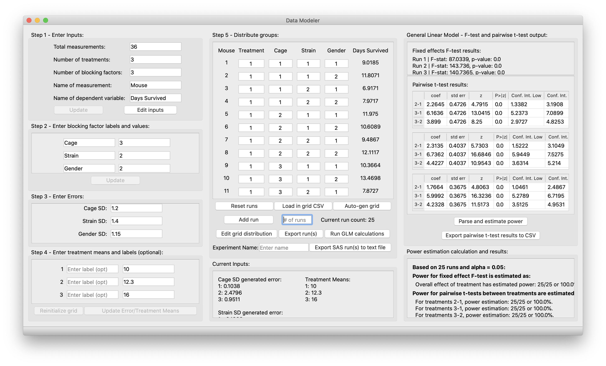

# Data Modeler for Power Calculations
This application is designed to aid scientists in the early-stages of designing an experiment with animal models or other subjects. Utilizing the program, one can fine-tune how many measurements they will want to use based on expected blocking factors, standard deviations, and treatments. The application takes these user inputs and calculates dependent variable values on various Gaussian distributions. Additionally, advanced features include rapid pre-experiment power calculations through in-house complete general linear model f-test and pairwise t-test analysis. Please refer to the [wiki](https://github.com/peytoncchen/Data-Modeler-Py/wiki) for specifics on app implementation and mathematical theory behind the application's algorithms.


## Installation
This application can be downloaded in multiple ways.

### Running via frozen macOS Application
- Download and save the .app file from the most [current release](https://github.com/peytoncchen/Data-Modeler-Py/releases)
- Run the app by double-clicking (if "unknown developer" warning, go to System Preferences > Security & Privacy > Open Anyway)
- Note: this is only for macOS, however Windows users can run py2exe themselves, if they wish.

### Running via source code with Python 3
- Requirements
  - Download and install [Python](https://www.python.org) 3.5+
  - Clone the project:
  ```
  git clone https://github.com/peytoncchen/Data-Modeler-Py.git
  ```
    - Or: download the source code into a zip file from the green button labelled 'Code'
  - (Optional but highly recommended): Make sure you are in the source code directory and set up a python virtual environment with
  ```
  python3 -m venv NameOfVenv
  ```
  - Make sure you are in the source code directory and install all necessary dependencies:
  ```
  pip install -r requirements.txt
  ```
  - Run!
  ```
  python3 datamodeler.py
  ```
### Running via alias-mode macOS Application
- Follow all steps from "Running via source code with Python 3"
- Run py2app
```
python3 py2appfiles/setup.py py2app -A
```
  - Note, without the -A, py2app will freeze the app into stand-alone form.
  - With this, you will need to re-run the command if any new files are added but not if changes are made to existing files.
- In my opinion, this is the best method, as you can run the application without the command line, it is more flexible than the completely frozen application, and you get the cute mouse icon.

## Quick-start documentation
Please refer to this [document](USERMANUAL.md) for basic, quick-start documentation.

## Built With
- Python 3
- Various packages: scipy, numpy, pandas, PyQt5, xlsxwriter, statsmodels, py2app

## Feedback/Development
The code for this application is open source and can be downloaded and modified as you wish. 

Please report any bugs or feedback to peytonc@stanford.edu

## Releases
For the various versions and releases available, see the [releases page](https://github.com/peytoncchen/Data-Modeler-Py/releases).

## Licensing
This application is licensed under the GNU GPL (General Public License) v3.0. See [LICENSE.txt](LICENSE.txt) for more details.

## Developers
- Peyton Chen

## Acknowledgments
- Caitlin Maikawa, Stanford Bioengineering Ph.D.
  - for all the help with complex statistics and components of UI design
- Eric Appel, Assistant Professor of Material Sicence and Engineering at Stanford University
- Appel Lab (hence the little apple in the icon!)
- Stanford Department of Bioengineering Research Experience for Undergraduates (REU) Program, Summer 2020