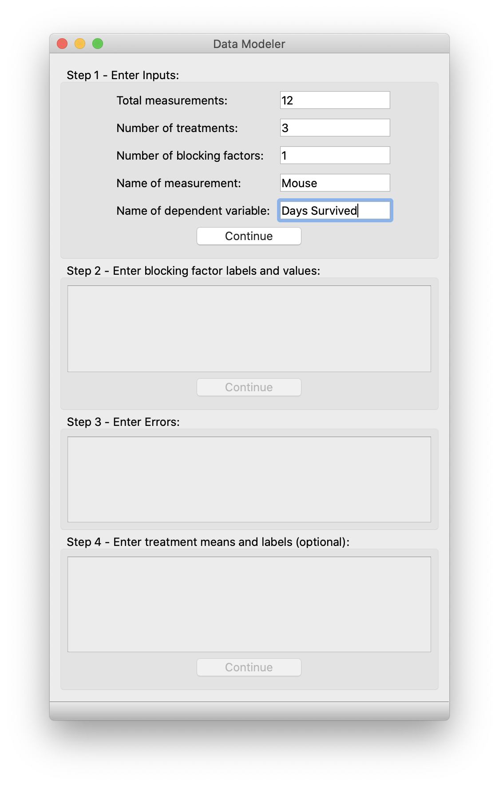
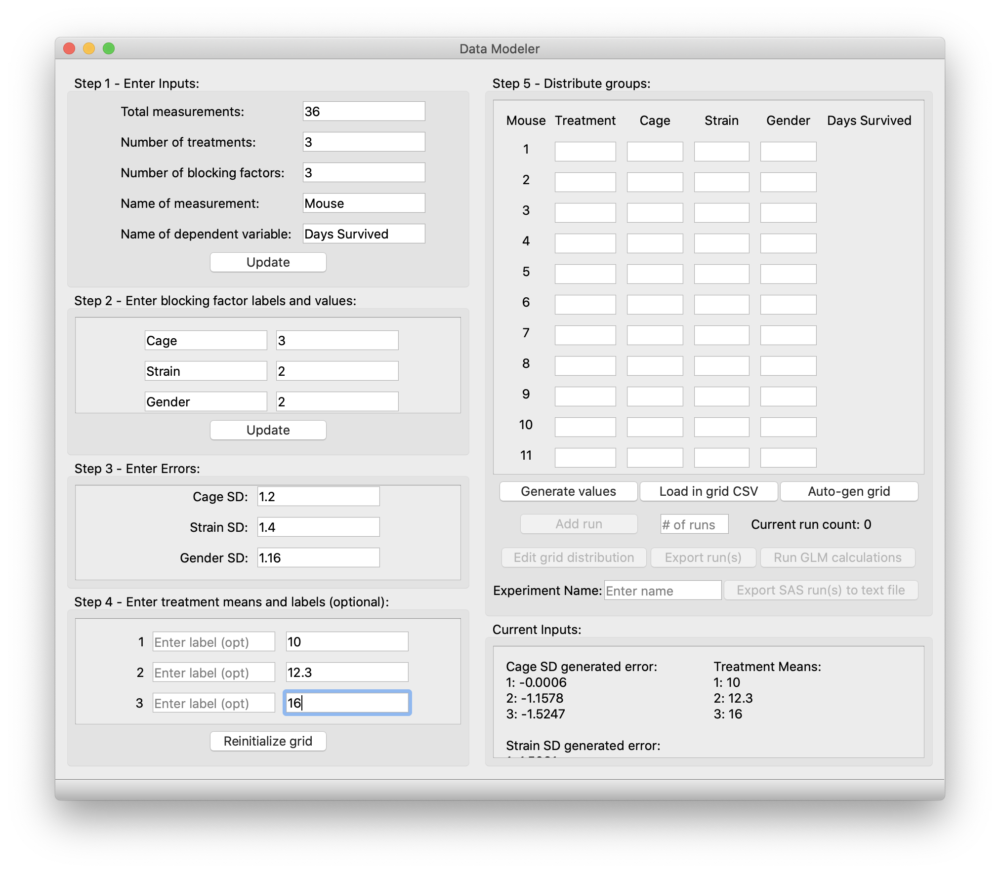

# Quick Start User Manual
Thank you for downloading Data Modeler for Power Calculations! We hope this tool will serve you useful in your research workflow and experimental design.

## Here are a few quick-tips.
Upon first start - this application will be a window sized 450px wide and 750px high. This application will automatically resize by getting larger or smaller based on the user input - this is normal behavior. Fully expanded, this application will be 1350px wide and 750px high. You can expand the window as large as you want but it cannot be smaller than the specified size.

Regarding input errors: if there is an issue with your inputs, pay attention to the status bar at the bottom of the app, it will glow red with an error message detailing how to fix your inputs. A yellow glow with an error message is not a fatal error, but merely a warning.

Additionally, all boxes, other than the box labeled step 1, as that is a static size, are scrollable views. Make sure to scroll through and fill out every value. If you think that you have entered every input correctly and a warning pops up in the status bar, chances are you may have forgotten to fill out values that are hidden by the scroll views.

## Table of Contents
- [Purpose statement](#detailed-purpose-statement)

Step 1 - 4 is completed on Pane 1. Minimum window size: (450 x 750)
- [Pane 1](#pane-1)
  - [Step 1](#step-1---enter-inputs)
  - [Step 2](#step-2---enter-blocking-factor-labels-and-values)
  - [Step 3](#step-3---enter-estimated-error-standard-deviations)
  - [Step 4](#step-4---enter-treatment-means-and-labels)

Step 5, distributing groups and dependent variable value generation, is completed on Pane 2. Minimum window size: (900 x 750)
- [Pane 2](#pane-2)
  - [Current Inputs](#current-inputs)
  - [Step 5 - Distributing Groups](#distributing-groups)
    - [By hand](#by-hand)
    - [Load in CSV](#load-in-csv)
    - [Auto-generate grid](#auto-gen-grid)
    - [General advice for this section](#general-advice-for-this-section)

  - [Pane 2 buttons](#pane-2-buttons)
    - [Generate values and Edit Inputs (new pane 1 button)](#generate-values-and-edit-inputs)
    - [Add run](#add-run)
    - [Edit grid distribution](#edit-grid-distribution)
    - [Export run(s) and Export SAS run(s)](#export-runs-and-export-sas-runs)
    - [Run GLM (General Linear Model) Calculations](#run-glm-calculations)

GLM (general linear model) analysis and results are completed on Pane 3. Minimum window size: (1350 x 750)
  - [Pane 3](#pane-3)
    - [Fixed effect F-test](#fixed-effect-f-test)
    - [Pairwise t-test](#pairwise-t-test)
    - [Power estimation calculations and results](#power-estimation-calculations-and-results)

    - [Pane 3 buttons](#pane-3-buttons)
      - [Parse and estimate power](#parse-and-estimate-power)
      - [Export pairwise t-test results to CSV](#export-pairwise-t-test-results-to-csv)
  

  - [Menu bar](#menu-bar)
    - [Session](#session)
      - [Save to Excel](#save-to-excel)
      - [Reset](#reset)
      - [Dump to JSON](#dump-to-json)
      - [Load from JSON](#load-from-json)
    - Help
      - Documentation... should link you right here!
      - [Feedback](#feedback)

## Detailed-purpose statement
Power is defined as the probability of correctly rejecting the null hypothesis in favor of the alternative hypothesis. This is crucial for experiment study design to ensure correct sample size for your study.

Power equations describe the relationship between 4 variables:
  - Significance criterion or critcal alpha (commonly set at 0.05)
  - The sample size, N
  - The population effect size
  - Power

Power calculations can be complex and are hard to calculate by hand.

Most power calculators are limiting and can only be done with a simple t-test. This means crucial experimental aspects like multiple treatment groups, blocking factors, corrections for multiple comparisons, and other more complicated experimental design elements cannot be incorporated.

**Solution 1: Resource Equation**

Power calculations require estimates of effect size, however effect size can be difficult to estimate accurately. Instead we can use the Mead resource equation degrees of freedom analysis to approximate sample sizes. Mead resource equation can be used for complex experimental designs, and does not require an estimate of standard deviation or effect size. Recommended reading can be found below. 

In short, the resource equation is based on diminishing returns, where an inflection point can be found at 10 error degrees of freedom, and at 20 degrees of freedom the curve begins to plateau. Thus, a sample size that results in error degrees of freedom between 10-20 gives you a high probability of detecting a meaningful effect size. 

*References*:
Mead R. 1988. The design of experiments: statistical principles for practical applications. New York (NY): Cambridge University Press.

Festing MF, Overend P, Gaines Das R, Cortina-Borja M, Berdoy M. 2002. The design of animal experiments: reducing the use of animals in research through better experimental design. London (United Kingdom): The Royal Society of Medicine Press Limited.

Gaskill, B. N, Garner, J. P. 2020. Power to the People: Power, Negative Results and Sample Size. JAALAS, 59, 1-8. 

**Solution 2: Data Modeling**
- Generating model data for your study allows you to then run more complex statistical analyses
  - E.g. general linear model or multiple comparison tests
- You generate data and run these analyses multiple times and estimate the power by counting the number of times you reject the null hypothesis with a p-value less than 0.05. 

Enter the Data Modeler for Power Calculations. It is more akin to Solution 2 but designed with preclinical drug delivery applications in mind. It should be applicable to other research areas, but the language we use to define our variables originates with drug delivery in mind. We do recommend you start off with the resource equation and then use this software as a supplemental tool to generate model data to test out statistical analyses or check experiment power. Enjoy and best of luck with your science!

## Pane 1
Step 1 - 4 is completed on Pane 1.

### Step 1 - Enter inputs
- Total measurements:
  - Enter your expected number of total measurements, e.g. 36 (This must be a positive integer)
- Number of treatments (i.e. primary cateogrical fixed effect):
  - Enter your expected number of treatments, e.g. 3 (This must be a positive integer)
- Number of blocking factors (i.e. source of variablity that is not of primary interest):
  - Enter your expect number of blocking factors, e.g. 2 blocking factors (you will label and give values to these later) (This must be a positive integer)
- Name of measurement and dependent variable:
  - Enter desired names for these variables

When you are done, click **Continue**. The "continue" button will be relabeled to "update" after the initial press. If you need to update these values later in the app, don't forget to click the **Update** button to make sure that the values are updated in the app's backend storage.

***Note***: This program has been designed to generate model data for categorical fixed effects. It cannot yet model continuous effects.

### Step 2 - Enter blocking factor labels and values
This box is based on your step 1 input value for "Number of blocking factors".
*Note*: If you have 0 blocking factors, the button will stay grayed out as you can skip this step and go directly to step 3.

- For each blocking factor, label them, e.g. Cage, Strain, or Gender
- For each blocking factor, give a value for each of them, e.g. if you plan to have 3 cages in your experiment you would input 'Cage' in the left box and '3' in the right box.

When you are done, click **Continue**. Just like step 1, the "continue" button will be relabeled to "update" after the initial press. If you need to update these values later in the app, don't forget to click the **Update** button to make sure that the values are updated in the app's backend storage.

### Step 3 - Enter estimated error standard deviations
This box is based on your step 1 inputs value for "Number of blocking factors".
*Note*: Unlike step 1, even if you have 0 blocking factors, you will have "Total error SD" to fill out.
This step is for filling out estimated error standard deviations. (i.e. variance not paritioned to blocking factors, such as measurement error).

- Ask yourself this question for total error, what variance in the dependent variable do I expect between each measurement?
- Ask yourself these questions for all other fields, what variance in the dependent variable do I expect between each blocking factor, e.g. 1.1 for standard deviation between each of the 3 cages.

When you are done, continue directly to step 4, there is no dedicated button. If you need to update this field, there will be an **Update Error/Treatment Means** button that can be pressed to update both error and treatment means/labels.

### Step 4 - Enter treatment means and labels
In this box, enter the treatment means for the number of treatments you specified in step 1.
You can choose to label each treatment as well, this will not be used anywhere but in the Excel sheet you can choose to save.
Click [here](#save-to-excel) to learn more. 
When assigning treatments in pane 2, use the number assigned to each treatment.

When you are done, click **Continue** to expand the application and continue to pane 2 where you will distribute assignments to every measurement and generate dependent variable values. Soldier on!

## Pane 2
Step 5, distributing groups and dependent variable generation, is completed on Pane 2. Pane 1 will remain visible.
Here is what the app should look like at this stage. 

### Current Inputs
Upon pressing **Continue** from step 4, you will notice that a display below the Step 5 box labeled "Current Inputs". 
This box is to inform the user what the current inputs are. Based on the number of values for each blocking factor, that many error values are generated, e.g. if I have 3 cages with a cage SD of 1.2, a Gaussian distribution with SD 1.2 is created and 3 values are randomly picked from the distribution and assigned to each cage.
- **Please keep note of this display especially when updating inputs to make sure your inputs are correctly reflected in the app's backend storage**

### Distributing groups:
In the "Distribute groups" box, you aim to distribute assignments of groups to each of your measurements. If you want to reset the grid, you will notice that the **Continue** button from step 4 has changed to **Reinitialize grid**, which will reset and clear the grid so you can start fresh.

In the example from the app screenshot, I will select a treatment 1-3, a cage 1-3, a strain 1-2, and a gender 1-2 for each mouse.

- #### By hand
  - You can enter these values all *by hand* by entering values into the various textboxes, or see one of the options [below](#load-in-csv). 

- #### Load in CSV
  - One of your options is to load in a formatted CSV file by clicking on the **Load in CSV** button. This will bring up a file interface for you to select a .csv file to be imported into the app.
  - This option requires strict formatting of your CSV file, unrecognized CSV formats will be rejected.
  - *Guidelines*
    - Up at the top, label columns starting with "Treatment" followed by your blocking factors spelled exactly how you spelled them in the app.
    - Then, fill out the CSV file as you would by hand in the app. Since the first row is taken up by labels, you will start the first measurment's assignments on row 2. A good rule of thumb is to check that you have your (# of measurments + 1) rows in your CSV file.
    - An example CSV file is linked [here](misc/exampleloadincsv.csv). This example has 10 measurements, 3 treatments, and 3 blocking factors cage(3), color(3), species(3).
  - If after importing the file you would like to make changes, you can do so, but do note that changes will not be reflected in your CSV file.

- #### Auto-gen grid
  - Another one of your options is to have choose an algorithm to distribute assignments of groups for you. This is the fastest way to get this done, although may not produce the results you exactly want. However, it should do the trick in most cases.
  - Once you press on the button, an input dialog will pop up showing you 2 options, the "Cartesian product assignment" and the "Quasi-random low discrepancy sequence assignment". 

  - *Cartesian product assignment*
    - This method works best for any experiment that is smaller and for an experiment where you want every combination of treatment and blocking factors to be covered. 
    - This will ensure perfect factorial design.
    - If the number of measurements you selected is not a perfect multiple of the number of combinations, the status bar will glow red, warning you to add a multiple of the number of possible combinations. This algorithm cannot assign unless the number of measurements is a multiple of the number of possible combinations.

  - *Quasi-random low discrepancy sequence assignment*
    - This method works best for an experiment that is much larger ~(> 200) and for an experiment where you want to distribute assignments as evenly as possible to a sample size that is NOT a multiple of the number of possible combinations.
      - This is because, as the name suggests, this is a quasi-random method where it relies on large sample sizes to converge on its maximal benefit of being low discrepancy.
    - In most cases, you will want to utilize factorial design and hence, the cartesian product will serve you better.
    - The status bar will glow yellow, indicating this is an experimental method and that it is recommended the user check the values in the grid manually to ensure they conform to what they want.

- #### General advice for this section
  - Out of index values, i.e. if I assign treatment 4 to a mouse, will produce a warning. Similarly, if you enter a random string 'abc' for example, will produce a warning. Assign only valid integers.
  - Try to prevent overlap in assignments, i.e. treatment 1 is given only to male mice, and treatment 2 is given to female mice, then treatment and gender will be convoluted. If you have too much overlap if your assignments, the GLM (general linear model) F-test analysis will have degrees of freedom analysis error and will produce null values for the F-test.

### Pane 2 Buttons:
- #### Generate values and Edit Inputs
  - Once your grid is filled out, click generate values! This will generate 1 run of your experiment, you will see the dependent variable column populate in the grid scroll view. 

  - This program will add the assigned treatment value, randomly generated SD (on Gaussian distribution) for the assigned blocking factors, and generated total error SD (on Gaussian distribution) to create the dependent variable value.

  - Note at this point, pane 1 (step 1-4) will not be editable and a new button underneath step 1 labeled "Edit inputs" will pop up. This is to prevent accidental edits in the initial inputs. Additionally, the grid will be locked out and you will not be able to edit the grid. 

  - If you click "Edit inputs", dependent variable values will reset until you have finished updating. From this point on, make sure to click this button to edit your pane 1 inputs. Additionally, be sure to click the "Update" buttons under the inputs that you update. The application will only reinitialize inputs where necessary. As a reminder, step 3 inputs are tied to the buttons underneath step 4.

- #### Add run
  - **Runs enable power calculations**. This function repeats the model data generation and can be used to determine a probability of rejecting the null hypothesis over a certain number of runs.

    - After generating the initial run, you will see that you have an option to add runs as well as see your current run count. The dependent variable column will only display the most recent run, but don't worry, the app has stored all your other runs, if they exist. 

    - There is a textbox where you can specify how many runs you want to enter. Type in a positive integer and press "Add run". Pressing "Add Run" with nothing in the textbox still works, but it will add the default number of 1 additional run. At any point in time, you can press, "Reset runs" (used to say "Generate Values") to go back to only 1 run stored.

- #### Edit grid distribution
  - As noted in the [Generate values section](#generate-values-and-edit-inputs), the grid will be locked out and you will not be able to edit the grid. However, you can press the "Edit grid distribution" button, which will allow you to edit the grid distribution. Press "Generate Values" to generate dependent variable values again.

- #### Export runs and Export SAS runs
  - These are deprecated features, but may be useful in certain cases. Pressing either of these buttons will bring up a file dialog for you to select a file directory and name the file to which the text data will be saved.

  - Export run(s)
    - Exports all your runs and dependent variable values to a text file
    - For exporting all the data in your session see this [section](#save-to-excel) to see how to download your data to excel sheet.
  - Export SAS run(s)
    - Export all your runs as well as boilerplate to be run in SAS statistical software. The application is set up to generate a script to obtain the pairwise t-test results from a fitted general linear model with a Tukey correction. You can, of course, download and edit this code to perform tests that you wish. See this [section](#run-glm-calculations) to see how this can be done within this application. 

- #### Run GLM Calculations
  - The application will enlarge to its final size of 1350 x 750.
  - This button will fit, calculate, and display general linear model results for fixed effect F-tests and pairwise t-tests for each run. Results will be explained in the section below, [Pane 3](#pane-3)

## Pane 3
General linear model results for the fixed effect F-tests and pairwise t-test will be displayed here. You will be able to interact with the scroll views to see all the results, as well as parse and estimate power results and export the pairwise t-test results only to CSV.

### Fixed effect F-test
- This scroll view box will present the user with F-statistic values and the corresponding p-values. 

- An interpretation of this p-value would be "For run {#}, if there is no effect of treatment on the dependent variable (i.e. null hypothesis), the probability of seeing results like this are [insert p-value]". It is standard to reject the null hypothesis when the probability of the results occurring by chance are less than 5% (p < 0.05).

### Pairwise t-test
- Often in addition to knowing whether there is an overall effect of treatment on the dependent variable, we are most interested to know if there are differences between treatments. This requires multiple pair-wise comparisons, and a correction for multiple comparisons. Here we use pariwise t-tests between treatments and a Holm-Sidak (HS) correction for multiple comparisons.

- Adjusted p-values in this section can be interpreted similarly to above: e.g. "If the means of treatment 1 and treatment 2 are the same (null hypothesis), the probability of seeing these results is [insert p-value]".

  - This scroll view box will present the user with tables on pairwise t-test results.
  - Row labels will look something like this: "2-1", "3-1", and "3-2". This is saying that this row corresponds to the difference in values between treatments 2 and 1, 3 and 1, and 3 and 2, respectively.
  - Scroll horizontally to the left to find the correct p-value and whether or not the null hypothesis has been rejected after the hs (Holm-Sidak) correction.
  - See this [section](#export-pariwise-t-test-results-to-csv) for how to export these dataframes to a CSV to save the data or further analyze it.

### Power estimation calculations and results
- See this [section](#parse-and-estimate-power) below for how to activate this view.

- Based on the number of runs you have stored, and a standard alpha value of 0.05 (5%), the power will be estimated. The probability displayed is the probability of rejecting the null hypothesis under the experimental conditions you have set. This can help you determine whether your experiment is appropriately powered, or how small an effect size you can detect with a certain sample size.

### Pane 3 Buttons
- #### Parse and estimate power
  - Pressing this button will populate the scroll view underneath the general linear model results labeled "Power estimation calculation and results"

- #### Export pairwise t-test results to CSV
  - Pressing this button will bring up a file dialog where you can choose a file directory and name the file to save the dataframes to CSV.

## Menu Bar
Navigate to the top of the app (Windows), or the menu bar (by the Apple symbol) to find the built-in menu bar for the app.
There are a few key features that can be accessed by interacting with the menu bar or keyboard shortcuts.
Here's what it looks like on macOS:

### Session
- #### Save to Excel
  - This function will open a file dialog where you will choose a directory and filename to save all your current data to a single excel sheet, from Pane 1, Pane 2, and Pane 3, EXCEPT for the pairwise t-test results. This MUST be exported separately with the "Export pairwise t-test results to CSV".
    - Power estimations and F-test results are included, however.
  - **Shortcut - Ctrl + S**

- #### Reset
  - This button will reset the app as if you have just opened it. You can activate this function from anywhere at anytime during the app.
  - **Shortcut - Ctrl + R**

- #### Dump to JSON
  - This function will open a file dialog where you will choose a directory and filename to dump your current session data to JSON format. Save this somewhere you remember, and at a later time you can use the "Load from JSON" function to load in all your data and pick up where you last left off.
  - **Shortcut - Ctrl + J**

- #### Load from JSON
  - This function will open a file dialog where you will choose a JSON document to load a previous session data to the application and pick up where you last left off. Any changes you make will need to be dumped to JSON again, the original file you loaded will stay the same.
  - A malformed JSON not generated or modified so that it is unrecognizable will be rejected and a red warning will show on the status bar.
  - **Shortcut - Ctrl + L**

### Help
By clicking on documentation or the shortcut **Ctrl + D**, you should have arrived here!
- #### Feedback
  - For any feedback or bugs, please feel free to email peytonc@stanford.edu

### Authors
Peyton Chen and Catlin Maikawa

