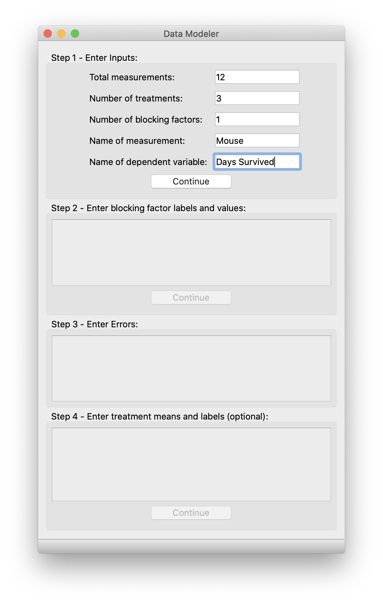
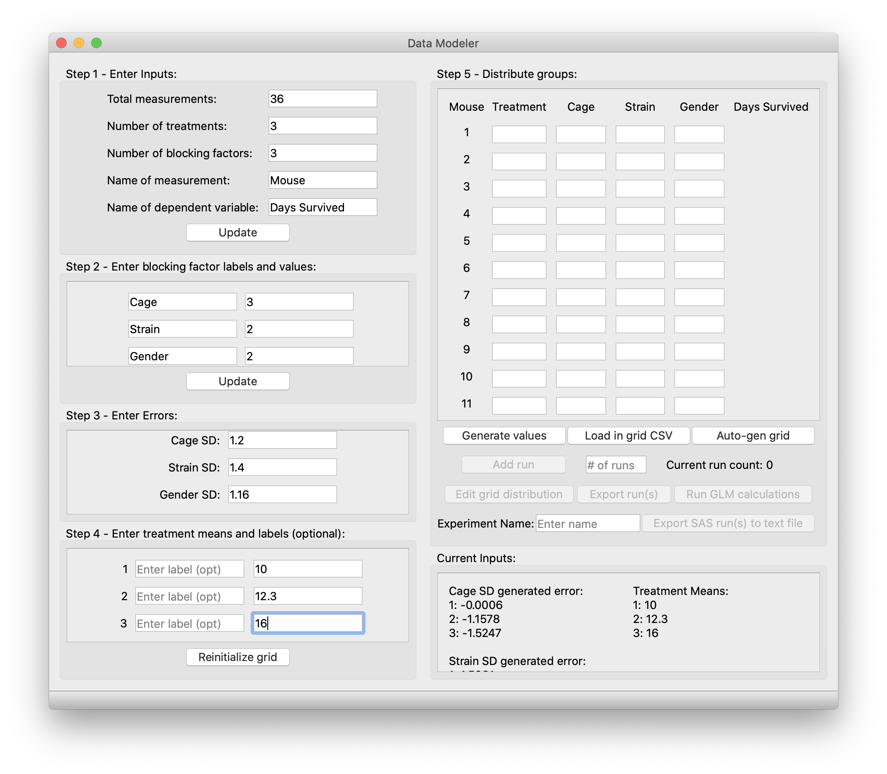

# Quick Start User Manual
Thank you for downloading Data Modeler for Power Calculations! We hope this tool will serve you useful in your research workflow and experimental design.

## Here are a few quick-tips.
Upon first start - this application will be a window sized 450px wide and 750 high. This application will automatically resize by getting larger or smaller based on the user input - this is normal behavior. Fully expanded, this application will be 1350px wide and 750px high. You can expand the window as large as you want but it cannot be smaller than the specified size.

Regarding input errors: if there is an issue with your inputs, pay attention to the status bar at the bottom of the app, it will glow red with an error message detailing how to fix your inputs. A yellow glow with an error message is not a fatal error, but merely a warning.

Additionally, all boxes, other than the box labelled step 1, as that is a static size, are scrollable views. Make sure to scroll through and fill out every value. If you think that you have entered every input correctly and a warning pops up in the status bar, chances are you may have forgotten to fill out values that are hidden by the scroll views.

## Table of Contents
Step 1 - 4 is completed on Pane 1. Minimum window size: (450 x 750)
- [Pane 1](#pane-1)
  - [Step 1](#step-1---enter-inputs)
  - [Step 2](#step-2---enter-blocking-factor-labels-and-values-(if-applicable))
  - [Step 3](#step-3---enter-estimated-error-standard-deviations)
  - [Step 4](#step-4---enter-treatment-means-and-labels-(optional))

Step 5, distributing groups and dependent variable value generation, is completed on Pane 2. Minimum window size: (900 x 450)
- [Pane 2](#pane-2)
  - [Current Inputs](#current-inputs)
  - [Step 5 - Distributing Groups](#distributing-groups)
    - [By hand](#by-hand)
    - [Load in CSV](#load-in-csv)
    - [Auto-generate grid](#auto-gen-grid)
    - [General advice for this section](#general-advice-for-this-section)
  - 

## Detailed-purpose statement
To be written.

## Pane 1
Step 1 - 4 is completed on Pane 1.

### Step 1 - Enter inputs
- Total measurements:
  - Enter your expected number of total measurments, e.g. 36 (This must be a positive integer)
- Number of treatments:
  - Enter your expected number of treatments, e.g. 3 (This must be a positive integer)
- Number of blocking factors:
  - Enter your expect number of blocking factors, e.g. 2 blocking factors (you will label and give values to these later) (This must be a positive integer)
- Name of measurement and dependent variable:
  - Enter desired names for these variables

When you are done, click **Continue**. The "continue" button will be relabelled to "update" after the initial press. If you need to update these values later in the app, don't forget to click the **Update** button to make sure that the values are updated in the app's backend storage.

### Step 2 - Enter blocking factor labels and values (if applicable)
This box is based on your step 1 input value for "Number of blocking factors".
*Note*: If you have 0 blocking factors, the button will stay grayed out as you can skip this step and go directly to step 3.

- For each blocking factor, label them, e.g. Cage, Color, or Gender
- For each blocking factor, give a value for each of them, e.g. if you plan to have 3 cages in your experiment you would input 'Cage' in the left box and '3' in the right box.

When you are done, click **Continue**. Just like step 1, the "continue" button will be relabelled to "update" after the initial press. If you need to update these values later in the app, don't forget to click the **Update** button to make sure that the values are updated in the app's backend storage.

### Step 3 - Enter estimated error standard deviations
This box is based on your step 1 inputs value for "Number of blocking factors".
*Note*: Unlike step 1, even if you have 0 blocking factors, you will have "Total error SD" to fill out.
This step is for filling out estimated error standard deviations. 

- Ask yourself this question for total error, what standard deviation do I expect between each measurment?
- Ask yourself these questions for all other fields, what standard deviation do I expect between each blocking factor, e.g. 1.1 for SD between each of the 3 cages.

When you are done, continue directly to step 4, there is no dedicated button. If you need to update this field, there will be an **Update Error/Treatment Means** button that can be pressed to update both error and treatment means/labels.

### Step 4 - Enter treatment means and labels (optional)
In this box, enter the treatment means for the number of treatments you specified in step 1.
You can choose to label each treatment as well, this will not be used anywhere but in the Excel sheet you can choose to save.
Click [here](#save-to-excel) to learn more. 
When assigning treatments in pane 2, use the number assigned to each treatment.

When you are done, click **Continue** to expand the application and continue to pane 2 where you will distribute assignments to every measurement and generate dependent variable values. Soldier on!

## Pane 2
Step 5, distributing groups and dependent variable generation, is completed on Pane 2. Pane 1 will remain visible.
Here is what the app should look like at this stage. 

### Current Inputs
Upon pressing **Continue** from step 4, you will notice that a display below the Step 5 box labelled "Current Inputs". 
This box is to inform the user what the current inputs are. Based on the number of values for each blocking factor, that many error values are generated, e.g. if I have 3 cages with a cage SD of 1.2, a Gaussian distribution with SD 1.2 is created and 3 values are randomly picked from the distribution and assigned to each cage.
- **Please keep note of this display to make sure your inputs are correctly reflected in the app's backend storage**

### Distributing groups:
In the "Distribute groups" box, you aim to distribute assignments of groups to each of your measurements. If you want to reset the grid, you will notice that the **Continue** button from step 4 has changed to **Reinitialize grid**, which will reset and clear the grid so you can start fresh.

In the example from the app screenshot, I will select a treatment 1-3, a cage 1-3, a color 1-2, and a gender 1-2 for each mouse.

- #### By hand
  - You can enter these values all *by hand* by entering values into the various textboxes, or see one of the options [below](#load-in-csv). 

- #### Load in CSV
  - One of your options is to load in a formatted CSV file by clicking on the **Load in CSV** button. This will bring up a file interface for you to select a .csv file to be imported into the app.
  - This option requires strict formatting of your CSV file, unrecognized CSV formats will be rejected.
  - *Guidelines*
    - Up at the top, label columns starting with "Treatment" followed by your blocking factors spelled exactly how you spelled them in the app.
    - Then, fill out the CSV file as you would by hand in the app. Since the first row is taken up by labels, you will start the first measurment's assignments on row 2. A good rule of thumb is to check that you have your (# of measurments + 1) rows in your CSV file.
    - An example CSV file is linked [here](misc/exampleloadincsv.csv). This example has 10 measurements, 3 treatments, and 3 blocking factors cage(3), color(3), species(3).
  - If after importing the file you would like to make changes, you can do so, but do note that changes will not be reflected in your CSV file.

- #### Auto-gen grid
  - Another one of your options is to have choose an algorithm to distribute assignments of groups for you. This is the fastest way to get this done, although may not produce the results you exactly want. However, it should do the trick in most cases.
  - Once you press on the button, an input dialog will pop up showing you 2 options, the "Cartesian product assignment" and the "Quasi-random low discrepancy sequence assignment". 

  - *Cartesian product assignment*
    - This method works best for any experiment that is smaller and for an experiment where you want every combination of treatment and blocking factors to be covered. 
    - This will ensure perfect factorial design.
    - If the number of measurements you selected is not a perfect multiple of the number of combinations, the status bar will glow red, warning you to add a multiple of the number of possible combinations. This algorithm cannot assign unless the number of measurements is a multiple of the number of possible combinations.

  - *Quasi-random low discrepancy sequence assignment*
    - This method works best for an experiment that is much larger ~(> 200) and for an experiment where you want to distribute assignments as evenly as possible to a sample size that is NOT a multiple of the number of possible combinations.
      - This is because, as the name suggests, this is a quasi-random method where it relies on large sample sizes to converge on its maximal benefit of being low discrepancy.
    - In most cases, you will want to utilize factorial design and hence, the cartesian product will serve you better.
    - The status bar will glow yellow, indicating this is an experimental method and that it is recommended the user check the values in the grid manually to ensure they conform to what they want.

- #### General advice for this section
  - Out of index values, i.e. if I assign treatment 4 to a mouse, will produce a warning. Similarly, if you enter a random string 'abc' for example, will produce a warning. Assign only valid integers.
  - Try to prevent overlap in assignments, i.e. don't have tons of mice all assigned the same combination of treatment 1, cage 1, color 1, and gender 1. If you have too much overlap if your assignments, the GLM f-test analysis will have degrees of freedom analysis error and will produce null values for the f-test.

## Pane 3
To be written...

## Menu Bar
Navigate to the top of the app (Windows), or the menu bar (by the Apple symbol) to find the built-in menu bar for the app.
There are a few key features that can be accessed by interacting with the menu bar or keyboard shortcuts.
### Save to Excel
To be written...